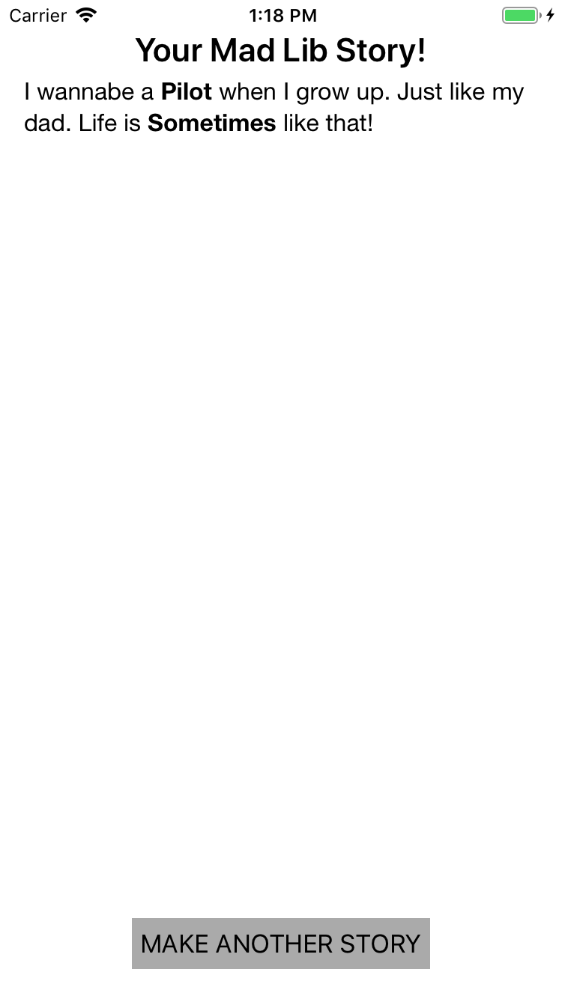

# Mad Libs
Mad Libs is a game where a user can make a story by entering words, before they know what the story will be. This way funny storys can be made.

This is the page where the game starts and where the user can choose a story.

On this page, the user can input words. If they don't enter  a word and press OK, they get a message "Fill in a valid word!"

If they have entered a correct word, they get a message "Well done!"

The user can read their story and can go back to the main screen and start a new story.
